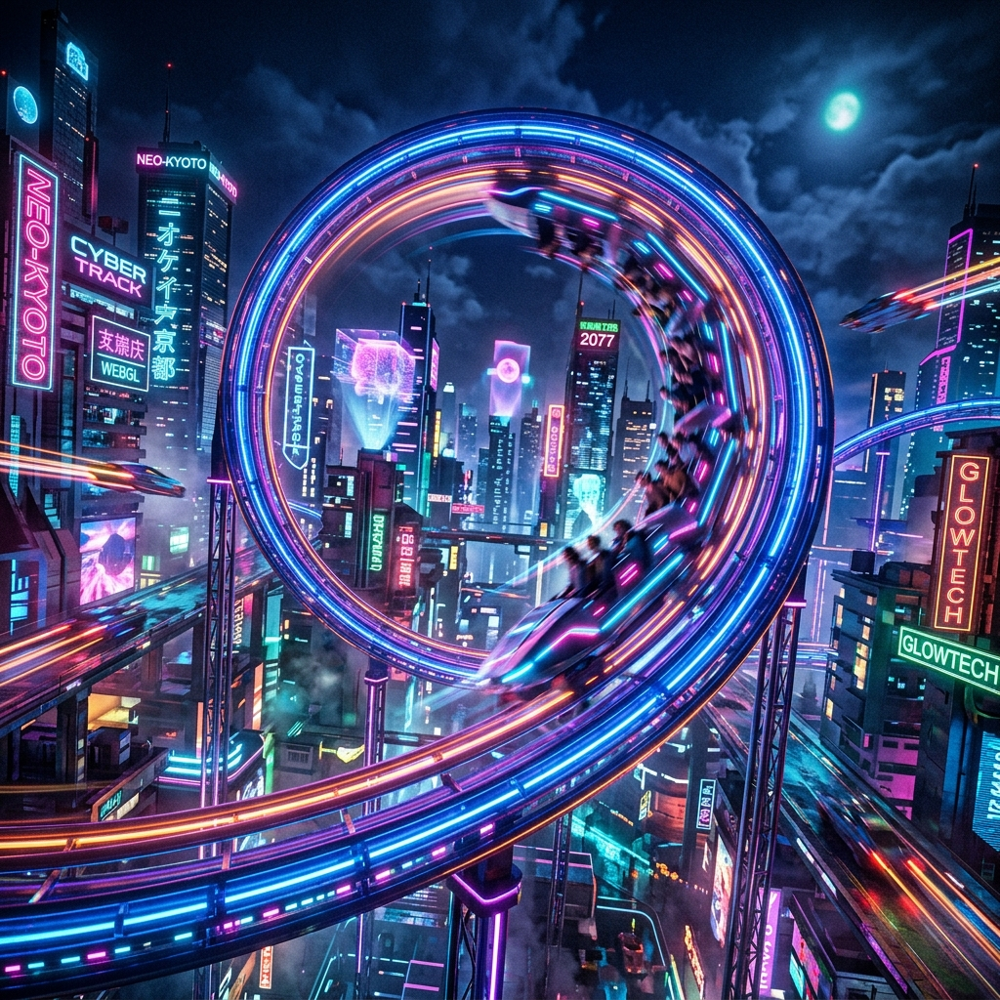

# 🎢 WebGL Roller Coaster Simulator



## 📝 Deskripsi
**WebGL Roller Coaster Simulator** adalah aplikasi web interaktif berbasis **React** dan **Three.js** yang mensimulasikan perjalanan roller coaster dalam lingkungan 3D yang dinamis. Project ini menggabungkan teknik grafika komputer tingkat lanjut dengan simulasi fisika untuk memberikan pengalaman visual yang memukau langsung di browser Anda.

Aplikasi ini menampilkan lintasan coaster tertutup berbasis spline, pergerakan kereta yang presisi, perhitungan metrik real-time, dan berbagai mode kamera untuk eksplorasi penuh.

## ✨ Fitur Utama
- **3 Preset Lintasan Unik**: 
  - `Beginner Loop`: Cocok untuk perkenalan awal.
  - `Corkscrew Extreme`: Menantang dengan banyak putaran tajam.
  - `Hypercoaster`: Fokus pada kecepatan tinggi dan elevasi ekstrem.
- **Simulasi Fisika Real-Time**: Menghitung kecepatan, momentum, gravitasi, friction, dan G-force berdasarkan geometri lintasan.
- **Sistem Kamera Dinamis**:
  - **First Person**: Rasakan sensasi duduk di kursi depan kereta.
  - **Third Person**: Lihat pergerakan kereta dari sudut pandang eksternal.
  - **Free Camera**: Jelajahi seluruh lingkungan secara bebas menggunakan keyboard dan mouse.
- **HUD Interaktif & Telemetri**: Monitor data simulasi secara real-time termasuk FPS, ketinggian, gradien, dan progres lintasan. Dilengkapi juga dengan tombol **Toggle UI** untuk menyembunyikan antarmuka dan menikmati pemandangan 3D secara penuh.
- **Visual Berkualitas Tinggi**: Struktur lintasan yang detail (rails, sleepers, ties, supports) dan lingkungan terrain yang diukir secara prosedural.

## 🚀 Teknologi yang Digunakan
- **Core**: React 18 & Vite
- **Rendering**: Three.js (WebGL)
- **Animation**: GSAP
- **State Management**: Zustand
- **Physics**: Custom Engine (dengan utilitas dari `cannon-es`)
- **Styling**: Vanilla CSS (Modern Dashboard Design)

## 🎮 Kontrol

### Kamera Bebas (Free Camera Mode)
- **W / A / S / D**: Bergerak maju, kiri, mundur, kanan.
- **Q / E**: Bergerak turun / naik.
- **Shift (Hold)**: Sprint (bergerak lebih cepat).
- **Mouse Right Click + Drag**: Rotasi kamera.
- **Scroll Wheel**: Mengatur kecepatan gerak kamera.

### Kontrol Simulasi
- **Play/Pause**: Memulai atau menghentikan simulasi.
- **Reset**: Mengulang simulasi dari awal atau merestart scene.
- **Switch Track**: Mengganti lintasan secara instan melalui panel kontrol.
- **Toggle UI (Hide/Show UI)**: Menyembunyikan seluruh elemen antarmuka untuk memberikan pandangan yang bersih (*clean view*).

## 🛠️ Instalasi & Penggunaan

1. **Clone project ini** atau unduh source code-nya.
2. **Instal dependensi**:
   ```bash
   npm install
   ```
3. **Jalankan development server**:
   ```bash
   npm run dev
   ```
4. **Buka browser** dan akses alamat yang tertera (biasanya `http://localhost:5173`).

## 📂 Struktur Project
- `src/components`: Komponen React untuk UI dan integrasi scene.
- `src/objects`: Builder objek Three.js (Track, Train, Environment, dll).
- `src/scenes`: Konfigurasi renderer, lighting, dan scene setup.
- `src/utils`: Logika teknis (Physics Engine, Track Generator, Camera Controller).
- `src/store`: State global aplikasi menggunakan Zustand.

## 🚧 Potensi Pengembangan
- Penambahan editor lintasan (Control Point GUI).
- Sistem collision detection untuk kamera bebas.
- Fitur ekspor/impor konfigurasi lintasan.
- Peningkatan kualitas visual terrain dan efek atmosferik.

---
*Dibuat untuk keperluan eksplorasi grafika komputer dan simulasi interaktif.*
